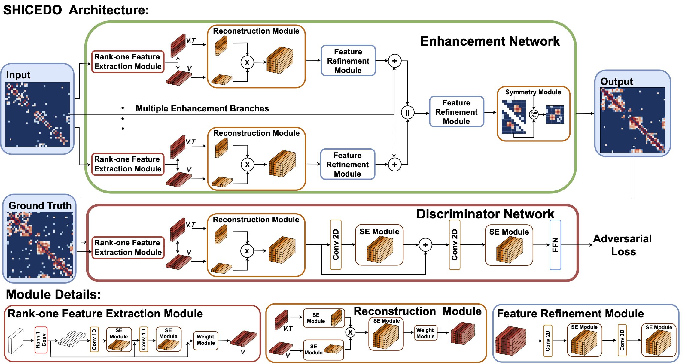

# SHICEDO: Single-cell Hi-C Data Enhancement with Reduced Over-smoothing
 
 
Single-cell Hi-C (scHi-C) technologies have significantly advanced our understanding of the three-dimensional genome organization. However, scHi-C data are often sparse and noisy, leading to substantial computational challenges in downstream analyses.  
In this study, we introduce SHICEDO, a novel deep-learning model specifically designed to enhance scHi-C contact matrices by imputing missing or sparsely captured chromatin contacts through a generative adversarial framework. SHICEDO leverages the unique structural characteristics of scHi-C matrices to derive customized features that enable effective data enhancement}. Additionally, the model incorporates a channel-wise attention mechanism to mitigate the over-smoothing issue commonly associated with scHi-C enhancement methods. 
Through simulations and real-data applications, we demonstrate that SHICEDO outperforms the state-of-the-art methods, achieving superior quantitative and qualitative results. 
Moreover, SHICEDO enhances key structural features in scHi-C data, thus enabling more precise delineation of chromatin structures such as A/B compartments, TAD-like domains, and chromatin loops. 

> *This is a citation from a [source](https://www.example.com).*
- [SHICEDO](#SHICEDO:-Single-cell-Hi-C-Resolution-Enhancement-with-Reduced-Over-smoothing)
  - [Installation](#Installation)
  - [Download processed data](#Download-processed-data)
  - [Training](#Training)
  - [Prediction](#Prediction)
  - [Prediction with pre-trained model](#Prediction-with-pre-trained-model)
  - [Evaluation](#Evaluation)
  - [Data preprocessing](#Data-preprocessing)
  - [Heatmap and loss visualization](#Heatmap-and-loss-visualization)
- [Demo](#Demo)
## Installation
For the environment: Install PyTorch based on the CUDA version of your machine.  
Please check [PyTorch](https://pytorch.org/get-started/previous-versions/) for details 
 
In this demo, the machine has CUDA Version: 11.6 
To create SCHICEDO environment, use:  
`conda env create -f SCHICEDO_environment.yml`  
To activate this environment, use 
`conda activate SCHICEDO`
## Download processed data
The processed data is available at the following link: 
[Download processed data](https://drive.google.com/drive/folders/1EgkzPoNG-s_pi3SKOFG_YFslpIar_Bht?usp=sharing). 
There are two processed data available, in the following example, we will demo with processed Lee et al. dataset in folder Lee  
The downloaded data may be compressed in different files, please move the files into one folder after Extract  
1. `mkdir data` 
2. Please download the processed data to the data folder and use the correct path in the script for data loading. 
If you wish to preprocess other datasets. Please check the data preprocessing section

## Data preprocessing
If you wish to process raw data, please run the following command:  
In this example, we show how to process the Nagano et al raw data is available at [Download raw data](https://drive.google.com/drive/folders/1UihcMw9DNR35Wps6FKVw-5EbiR7Tw55u?usp=sharing). 
`cd data_preprocessing` 
`mkdir process_data/Nagano`

` ./data_preprocessing.sh`  
data_preprocessing.sh will run 6 scripts to save processed data:  
1. Filter the cells based on contact number `python data_filter.py` 
2. Filter out the inter-chromosomal interactions `python filter_true_data.py` 
3. Downsampling the matrix to generate low-resolution input `python down_sampling_sciHiC.py` 
4. Run Rscrip to do Bandnorm `Rscript bandnorm.R` 
   (Please follow the instruction to install [Bandnorm](https://sshen82.github.io/BandNorm/index.html)) 
5. Organize normalized results `python run_bandnorm.py` 
6. Divide large matrixes into submatrices and save as torch tensor `python generate_input.py` 

## Training
For optimal performance when training on new data, parameter fine-tuning is essential. 
The model and date setting were the same as described in the paper.   
After choosing suitable hyper-parameters, the model can be trained with the following command:  
`python test_train.py`  

## Prediction
After training, Enhanced scHi-C can predict with the following command: 
`python test_prediction.py`  
Users can also use the provided pre-trained model to make predictions.  
Please change the corresponding model loading path in the test_prediction.py file. 

## Prediction with pre-trained model
Users can use the provided pre-trained model to make the prediction: 
1. `mkdir pretrained_model` 
2. Please download the pretrained model to the pretrained_model folder and use the correct path in the script [Download pre-trained model](https://drive.google.com/drive/folders/1URpt1Ro1MZhUh-ECdEQFLx0iunlA7K7B?usp=sharing). 
3. `python test_pretrained_prediction.py` 

## Evaluation
After prediction, users can generate the MSE and macro F1 of low resolution and prediction by running the following command: 
`python test_evaluation.py` 

## Heatmap and loss visualization   
If you wish to check the heatmap of low resolution, prediction, and true scHi-C, please run the following command: 
`tensorboard --logdir=runs/heatmap`  

## Demo
Here we used processed Lee et al. (download from [Download processed data](https://drive.google.com/drive/folders/1EgkzPoNG-s_pi3SKOFG_YFslpIar_Bht?usp=sharing)) to demo the training, prediction and evaluation process: 
`>> conda activate SHICEDO`  
`> python test_train.py` 
`> python test_prediction.py` 
`> python test_evaluation.py` 
For heatmap and loss visitation:  
`tensorboard --logdir=runs/heatmap` 

## Citation

**Paper:**
> Huang, J., Ma, R., Strobel, M., Hu, Y., Ye, T., Jiang, T., & Ma, W. (2025).  
> *SHICEDO: Single-cell Hi-C Data Enhancement with Reduced Over-Smoothing.*  
> *Bioinformatics*, btaf575.  
> DOI: [https://doi.org/10.1093/bioinformatics/btaf575](https://doi.org/10.1093/bioinformatics/btaf575)

**Code Repository:**
> Please cite this project using the DOI:  
> [10.5281/zenodo.17069264](https://doi.org/10.5281/zenodo.17069264)

## License
This project is licensed under the terms of the [MIT License](LICENSE).
